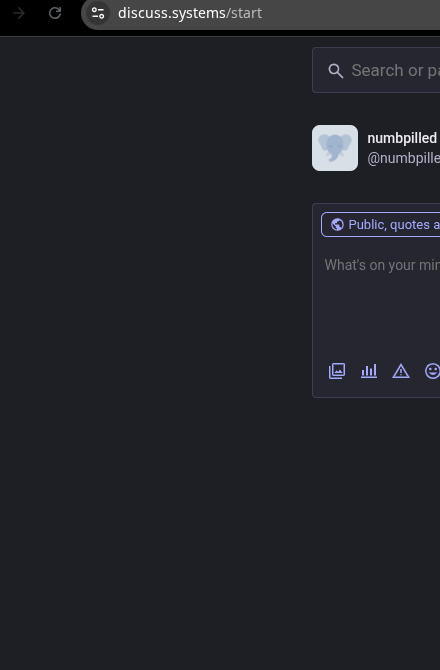

## switchboard

a calculator-sized ai-agent multiplexer for the desktop, dressed as an original
macintosh system application. run claude, opencode, codex, openclaw, crush, aider
— or any cli — each in its own tab, and see at a glance whether each one is
typing, thinking, waiting for you, or paused, colored under its tab title.

built with electron + node-pty + xterm.js. monochrome by default, fully themable.



---

### what it does

- runs each agent as a real login-shell pty in its own tab (falls back to a
  shell if the agent exits, so you never lose the pane)
- shows a live per-tab status dot and label, driven by an actual detector, not a
  guess
- classic macintosh system chrome: lined title bar, square close box, hard drop
  shadows — monochrome first, but fully themable
- five built-in themes, a control panel, configurable animations, and a full
  agent editor
- shows in the plasma taskbar with its own icon, and can be pinned as a widget

---

### install

```bash
git clone https://github.com/numbpill3d/switchboard.git ~/switchboard
cd ~/switchboard
./install.sh          # deps, native rebuild, app-menu entry, icons
npm start             # or launch "switchboard" from your app menu
```

requirements (all present on a normal arch dev box): `node`, `npm`, `gcc`,
`make`, `python3`, `node-gyp`, `unzip`. the installer builds the `node-pty`
native module against electron's abi; if npm blocks install scripts, it extracts
the cached electron binary and rebuilds automatically.

prefer a prebuilt archive? grab the latest from the
[releases](https://github.com/numbpill3d/switchboard/releases) page, unpack it,
and run `./install.sh`.

---

### using it

- `+` (top right) or `ctrl+t` — connect an agent (pick from the list)
- click a tab to focus it; type straight into the live terminal
- the close box on a tab (or `ctrl+w`) kills that session
- the gear in the title bar (or `ctrl+,`) opens the control panel
- the pin toggles always-on-top
- `ctrl+1..9` jump to a tab; `ctrl+tab` cycles; `ctrl+q` quits

open tabs are remembered and reopened next launch.

---

### the state model

each tab shows a colored dot and label under its name. the footer shows the
active tab's state and its subtree cpu%.

| color  | state                    | meaning                                             |
|--------|--------------------------|-----------------------------------------------------|
| green  | typing                   | fresh textual output is streaming right now         |
| yellow | thinking                 | output paused but the process is busy, or a spinner |
| red    | waiting                  | idle at a prompt / an approval question — needs you  |
| grey   | paused / idle / exited   | stopped, sitting quietly, or the process ended      |

how it's detected (this is inference, not telepathy):

1. pty output timing — bytes flowing means active. new letters/digits means
   typing; only spinner or box-redraw bytes means thinking.
2. subtree cpu — the session's whole process tree is sampled from `/proc` every
   ~250 ms. above the thinking-cpu threshold means thinking even when quiet.
3. prompt detection — an idle process whose last line looks like a shell/agent
   prompt or a yes/no question means waiting for input.
4. per-agent regexes — each agent profile can set a `thinking` and a `waiting`
   regex that override the generic logic. defaults ship for the known agents
   (for example, claude's "esc to interrupt" reads as thinking).

tune every threshold in control panel → detection. no heuristic is perfect for
every tui; the regexes are the escape hatch — edit them per agent.

---

### themes

control panel → appearance. ships with classic (b/w), platinum (grey), phosphor
(green crt), amber (crt), and midnight (dark). each rethemes the chrome and the
terminal palette, with a live preview while you pick.

want the real chicago typeface? drop a chicago or chikarego2 ttf into your fonts
and it is used automatically for the ui chrome; the terminal font is set
separately (defaults to your geistmono / 3270 nerd fonts).

### animations

control panel → animation. a master switch plus individual toggles: window
zoom-open, tab fade, pulsing state dots, marching tab spinner, typing shimmer,
and crt scanlines/flicker (phosphor and amber themes). all off in one click.

---

### agents

control panel → agents. each profile has a name, glyph, command, args, cwd, and
the two detection regexes. add your own — any cli works. reorder with the up
arrow, remove with the x.

config lives at `~/.config/switchboard/config.json` (settings + agents + open
tabs). defaults are in `config/default-agents.json`.

---

### desktop widget on kde plasma (wayland)

switchboard is a frameless always-on-top window that already shows in the taskbar
with its icon (the window's wayland `app_id` is `switchboard`, matching its
`.desktop`). to also pin it like a widget (no titlebar, on all desktops, kept
above), add a kwin rule:

system settings → window management → window rules → add new, match window class
= `switchboard` (substring), and set:

- keep above other windows → force → yes
- all desktops → force → yes
- no titlebar and frame → force → yes
- (optional) position → force → your corner

do not force skip-taskbar here if you want the taskbar icon — that is what hides
it. switchboard also has its own control panel → window → hide from taskbar
toggle (off by default).

or drop this file and reload kwin:

```bash
mkdir -p ~/.config
cat >> ~/.config/kwinrulesrc <<'RULE'
[switchboard]
Description=switchboard widget
wmclass=switchboard
wmclassmatch=1
above=true
aboverule=2
desktops=\x00
desktopsrule=2
RULE
qdbus6 org.kde.KWin /KWin reconfigure 2>/dev/null || true
```

---

### troubleshooting

- crash after an electron update — run `npm run rebuild` (re-links node-pty to
  electron)
- sandbox error — the launcher uses `--no-sandbox` (arch does not ship the suid
  helper set up); this is expected for a local widget
- an agent shows the wrong state — edit its `thinking`/`waiting` regex in control
  panel → agents, or nudge the detection thresholds
- no icon / a stale icon in the taskbar after changing the icon — plasma caches
  window icons in memory; refresh the shell once with
  `kquitapp6 plasmashell && kstart plasmashell`
- not in the taskbar at all — make sure hide-from-taskbar is off (control panel →
  window) and that no kwin rule forces skip-taskbar

---

### how it's built

- `main.js` — electron main process: frameless window, pty session manager, and
  the state engine (`/proc` subtree cpu + pty output timing + prompt/spinner
  heuristics + per-agent regexes)
- `preload.js` — the context-isolated ipc bridge
- `src/` — renderer: tab and terminal lifecycle, the state ui, control panel,
  themes, and animations
- `config/default-agents.json` — the shipped agent profiles
- `rebuild-pty.sh` — rebuilds node-pty against electron's abi with the system
  node-gyp
- `install.sh` — dependencies, native rebuild, desktop entry, and icons

mit.
